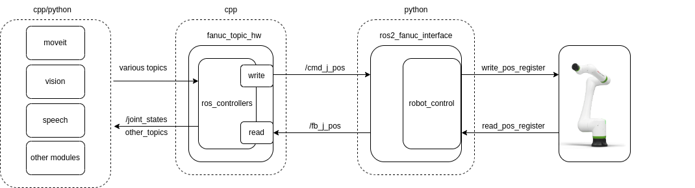

# ros2_fanuc_interface

This package implements a custom interface between ros2 and Fanuc robots. 
This implementation builds upon the [fanuc_ros2_driver](https://github.com/UofI-CDACS/fanuc_ros2_drivers) repository.

This package interfaces ros2 and the fanuc ros controller using ros topics.

i) cmd_j_pos (type: [sensor_msgs/msg/JointState.msg](https://docs.ros2.org/latest/api/sensor_msgs/msg/JointState.html)) - listened topic in the node that takes command joint positions (possible TODO: commanded velocities?) and writes on the Fanuc controller a Position Register(PR). Note: it is possible to write more than one PR, setting this number in the config/params.yaml file.

ii) fb_j_pos (type: [sensor_msgs/msg/JointState.msg](sensor_msgs/msg/JointState.msg)) - a published topic with feedback information about joint positions and velocities.
## Concepts
This package offers two different blocks relevant to run a Fanuc robot with ros:  
1. the ros2_fanuc_interface python node implements the actual communication between the remote pc and the actual robot controller
2. the fanuc_topic_hw implements a hardware interface that interfaces with the ros world according to the [ros2_control](https://control.ros.org/master/index.html) framework.
The schematic view of the framework is visible in the figure below.



## Installation guidelines

#### prerequisites
To comply with the [fanuc_ros2_driver](https://github.com/UofI-CDACS/fanuc_ros2_drivers) repository, it is necessary to have pycomm3 installed
```console
$ pip install pycomm3
```
##

To install the current package just
```console
$ cd <to-your-src>
$ git clone https://gitlab-core.supsi.ch/dti-isteps/armlab/fluently/ros2_fanuc_interface
$ git clone https://github.com/UofI-CDACS/fanuc_ros2_drivers
```
you should be ready to test the basic ros2-fanuc interface by publishing topics.

To use it with the [ros2_control](https://control.ros.org/master/index.html) framework, additional Moveit! and description packages are required. 
Download them
```console
$ git clone https://gitlab-core.supsi.ch/dti-isteps/armlab/fluently/crx20_moveit_config
$ git clone https://gitlab-core.supsi.ch/dti-isteps/armlab/fluently/crx_description
$ cd ..
$ colcon build --symlink-install
```
To complete the setup the [Moveit!2](https://moveit.picknik.ai/main/index.html) and the [ros2_control](https://control.ros.org/master/index.html) are expected to be running.
If some error appears, please check their installation and install them.
```console
$ sudo apt update
$ sudo apt upgrade
$ sudo apt install ros-<distro>-moveit
$ sudo apt install ros-<distro>-ros2-control
$ sudo apt install ros-<distro>-ros2-controllers
```

## usage


ros2 run ros2_fanuc_interface ros2_fanuc_interface.py
ros2 run ros2_fanuc_interface ros2_fanuc_fake_interface.py

To use it open a terminal and do the following command:

```console
$ ros2 launch ros2_fanuc_interface ros2_fanuc_interface.launch.py
```

To test with Moveit and ros_control pipelines, [crx_description](https://github.com/paolofrance/crx_description) and the  [crx20_moveit_config](https://github.com/paolofrance/crx20_moveit_config) packages are required. 
On a new terminal
```console
$ ros2 launch ros2_fanuc_interface moveit_test.launch.py
```

## Simple commands
It is possible to test it without Moveit! and ros_control.
To send a simple sinusoidal trajectory on the first joint, on a new terminal 

```console
$ ros2 run robot_traj_generator joint_state_pub.py
```

To test this with mock components just add the "use_mock_hardware:=true" param to your launch command
```console
$ ros2 launch ros2_fanuc_interface moveit_test.launch.py use_mock_hardware:=false
```

then to test joint commands
```console
$ ros2 topic pub /position_commands std_msgs/msg/Float64MultiArray "{data: [1.0, 0.0, 0.0, 0.0, -1.5707, 0.0],layout: {dim:[], data_offset: 1"}}
```

## simple trajectory execution without Moveit!

It is possible to send a test trajectory without the need for Moveit! but using the ros_control 
on a new terminal, to use the actual robot
```console
$ ros2 launch ros2_fanuc_interface ros2_fanuc_interface.launch.py
```
or if you want to use a virtual robot
```console
$ ros2 run ros2_fanuc_interface ros2_fanuc_fake_interface.py
```
then launch the ros_control framework and Rviz for visualization

```console
$ ros2 launch ros2_fanuc_interface ros_control_test.launch.py
```
finally, launch the trajectory publisher node

```console
$ ros2 run robot_traj_generator traj_pub.py
```
## Note
A fake "ros2_fanuc" interface allows testing the full stack including the actual ros hardware_interface, rather than using the standard mock components
This is useful to test different controllers (e.g., Cartesian Motions, Velocity scaling, etc.).
Note: to use force controllers, an integration with Gazebo is necessary, and still missing.
```console
$ ros2 run ros2_fanuc_interface ros2_fanuc_fake_interface.py
```
and on a new terminal
```console
$ ros2 launch ros2_fanuc_interface moveit_test.launch.py
```

The schematic view of the framework implementing the fake interface is visible in the figure below.


## Known issues
1. execution delay of about 0.5 seconds

## TODO
list of known todos and desiderata:  
1. implementation of the Fanuc DPM to allow faster control  --> WIP (to test it you must also esit the FANUCethernetipDriver from the [fanuc_ros2_driver](https://github.com/UofI-CDACS/fanuc_ros2_drivers) repository.)
2. implementation of the Fanuc RMI to remove the need for TP programs
3. cpp implementation of the interface with the robot controller to avoid the Python interface --> WIP